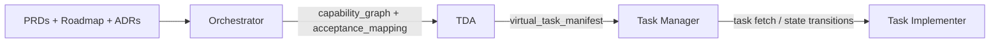

**Goal:** Explain how the virtual backlog flow operates end-to-end using the four core agents. Keep this concise; deep details live in each agent spec.

## Overview

Pipeline:

1. Roadmap Orchestrator → emits Capability Graph + Acceptance Mapping (or GAP report).
2. Task Decomposition Agent (TDA) → consumes graph & mapping → emits Virtual Task Manifest.
3. Task Manager → validates manifest, tracks state, exposes query/diff APIs.
4. Task Implementer (TIA) → executes individual tasks with test-first discipline via Task Manager transitions.



## Artifact Hand-off

| Stage | Artifact | Hash Anchor | Stored? |
|-------|----------|-------------|---------|
| Orchestrator | capability_graph | graph_hash | Optional debug (.generated) |
| Orchestrator | acceptance_mapping | inputs_hash (indirect) | Optional debug |
| TDA | virtual_task_manifest | manifest_hash | Optional debug |
| Task Manager | state events | (per line) | Optional append-only |

Debug persistence is not required for correctness; determinism allows regeneration.

## Typical Invocation Sequence (Conceptual CLI)

```text
orchestrator run --inputs-hash-check
tda decompose --from capabilities.json --map acceptance-mapping.json
task-manager ingest --manifest tasks.json
task-implementer start --task <TASK_ID>
```

Actual implementation details pending; above shows logical ordering.

## Decision States

| Agent | Decision / Status | Meaning |
|-------|-------------------|---------|
| Orchestrator | BLOCKED | Blocking gaps (ambiguous / unsatisfied spec) |
| Orchestrator | READY_FOR_DECOMPOSITION | Safe to run TDA |
| TDA | BLOCKED | Decomposition gaps (oversized, low-confidence AC) |
| TDA | OK | Manifest produced |
| Task Manager | DEGRADED | Non-blocking gaps present |

## GAP Escalation Ladder

1. Extraction (AC ambiguity, out-of-scope) → fix PRD / confirm deferral.
2. Decomposition (oversized task candidate) → refine capability or split logic.
3. Implementation (new risk discovery) → upstream ADR / capability update next cycle.

## Determinism Contract

| Layer | Deterministic Inputs | Deterministic Output |
|-------|----------------------|----------------------|
| Orchestrator | Canonical PRD sections + roadmap | Capability Graph + AC Map (ordered) |
| TDA | Graph + AC Map | Virtual Task Manifest (sorted) |
| Task Manager | Manifest + prior state | Drift delta + validated state machine |
| Implementer | Task record + tests | State transitions + event log |

## Quick Health Checks

| Check | How |
|-------|-----|
| Input drift | Recompute `inputs_hash` and compare orchestrator cache |
| Graph ordering | Verify phase/slice/id monotonic sequence |
| Coverage | Each AC hash appears in ≥ 1 task (post TDA) |
| GAP regression | Count new blocking gaps vs previous run |

## When to Re-run Each Agent

| Trigger | Agents to Re-run |
|---------|------------------|
| PRD text change | Orchestrator → (if READY) TDA → Manager |
| ADR added/modified | Orchestrator → cascade |
| Capability taxonomy tweak | Orchestrator + TDA |
| Decomposition heuristic change | TDA only (with same upstream hashes) |
| Task state progress | Task Manager (transitions) + Implementer |

## Minimal Success Definition (Phase 1)

| Criterion | Target |
|----------|--------|
| Orchestrator determinism | 100% identical hashes on repeat run (no change) |
| Decomposition blocking gap rate | < 5% of total capabilities |
| Ambiguous AC proportion | < 10% |
| Task coverage (AC linked) | 100% of non-gap ACs |

## Prompting Examples

Below are concise, copyable prompt templates for engaging each agent via an LLM or automation harness. Replace bracketed placeholders with concrete values.

### Orchestrator Prompt

```text
You are the Roadmap Orchestrator.
Inputs:
  - PRD files: [list relative paths]
  - Roadmap summary: [path]
  - ADRs referenced: [paths]
Task:
  1. Extract acceptance bullets from approved sections.
  2. Normalize & hash each bullet (sha256 lowercase single-spaced text).
  3. Derive capability candidates (phase, slice, category, risk, tdd flag, depends_on).
  4. Output JSON: capability_graph + acceptance_mapping following virtual-backlog-contract.md.
  5. Detect and list GAP codes (ambiguous, out-of-scope, low-confidence, duplicate, no-spec).
Constraints:
  - Do not invent capabilities without explicit AC signal.
  - Preserve original bullet text for traceability.
Output:
  { "decision": "READY_FOR_DECOMPOSITION" | "BLOCKED", "capability_graph": {...?}, "acceptance_mapping": {...?}, "gaps": [...] }
If BLOCKED include only gap list and counts; omit capability_graph & acceptance_mapping.
```

### Task Decomposition Agent (TDA) Prompt

```text
You are the Task Decomposition Agent.
Inputs:
  - capability_graph (JSON) with graph_hash: [hash]
  - acceptance_mapping (JSON) with inputs_hash: [hash]
  - orchestrator decision: READY_FOR_DECOMPOSITION
Goal: Produce a virtual_task_manifest or GAP report if blocking decomposition issues arise.
Steps:
  1. For each capability (canonical order) cluster its acceptance references.
  2. Apply splitting heuristics (size <= 1 dev-day; isolate distinct risk domains).
  3. Assign task_id: <CAPABILITY-ID>--TNN.
  4. Derive risk (inherit + escalate rules) and est.size (S/M/L heuristic).
  5. Build depends_on_tasks (capability dependency last-task chaining + intra ordering).
  6. Run gap analysis (AC-LOW-CONFIDENCE, TASK-OVERSIZED, TASK-DEP-CYCLE, YAGNI-CANDIDATE, DUP-AC-COVERAGE, EST-INCONSISTENT).
  7. If any blocking gaps -> status BLOCKED; emit gap list only.
  8. Else canonical sort tasks and compute manifest_hash (sha256 of canonical JSON without hash field).
Output:
  { "status": "OK", "virtual_task_manifest": {...} } or { "status": "BLOCKED", "gaps": [...] }.
Do not alter capability ids or AC hashes.
```

### Task Manager Prompt

```text
You are the Task Manager (validation & state layer).
Inputs:
  - virtual_task_manifest (JSON) with manifest_hash: [hash]
  - capability_graph.graph_hash: [hash]
  - acceptance_mapping.items (for AC hash validation)
  - previous manifest summary (optional)
Tasks:
  1. Structural validation (schema, ids, ordering, hash recompute).
  2. Referential integrity (capability_id exists, ac_hash present in acceptance_mapping).
  3. Drift delta vs previous (ADDED, REMOVED, MODIFIED, MOVED, UNCHANGED).
  4. GAP elevation (blocking vs warning) per policy.
  5. Emit state ingest acknowledgment or rejection with reasons.
Output JSON:
  { "ingest": "ACCEPTED"|"REJECTED", "manifest_hash": "...", "delta": {...}, "blocking_gaps": [...], "warnings": [...]}.
If REJECTED provide phases failed (STRUCTURAL, REFERENTIAL, HASH, GAP_POLICY).
```

### Task Implementer Prompt

```text
You are the Task Implementer.
Inputs:
  - task record (task_id, capability_id, ac_hashes, risk, depends_on_tasks)
  - acceptance_mapping entries for each ac_hash (raw + normalized text)
  - current manifest_hash: [hash]
  - dependency task states: [list]
Goal: Execute this task with test-first discipline and propose state transitions.
Procedure:
  1. Verify all dependencies completed; if not, respond with BLOCKED reason.
  2. For each AC hash produce minimal test assertions (list them) before implementation if risk != Low.
  3. Outline incremental implementation steps (each tied to one AC assertion).
  4. Identify any ambiguity or new risk; emit gap or risk events.
  5. Summarize completion readiness: all AC assertions covered? any blocking gaps?.
Output (choose one):
  - { "transition": "start", "task_id": "...", "manifest_hash": "...", "plan": { tests: [...], steps: [...] } }
  - { "transition": "blocked", "reason": "...", "pending_dependencies": [...] }
  - { "transition": "complete", "evidence": { assertions: [...], new_tests: [...], risk_notes: [...] } }
Never mutate the manifest; only propose transitions.
```

### GAP Report Prompt (Diagnostic)

```text
You are providing a concise GAP diagnostic for layer: [extraction|decomposition|manager].
Input gap entries: [list JSON entries]. Group by code; count occurrences; suggest prioritized remediation actions (max 5) focusing on unblocking next pipeline stage.
Output: Markdown table + ordered remediation list.
```

## References

* `virtual-backlog-contract.md`
* `task-decomposition-agent.md`
* `task-manager.md`
* `task-implementer.md`

---
**Next:** Ensure extraction guide v0.3.0 alignment before integrating CLI scaffolding.
