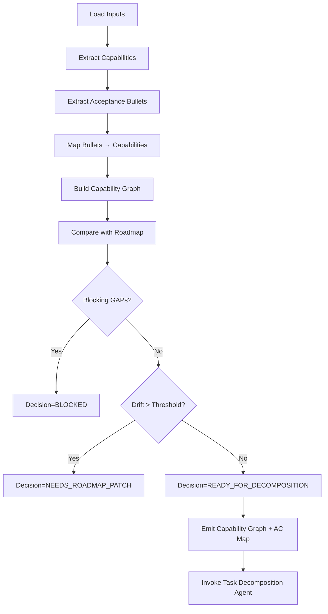

# Agent: Roadmap Orchestrator

**Purpose:** Canonical synchronization brain that reconciles Master PRD, feature PRDs, ADRs, and the living roadmap; emits a normalized capability + acceptance surface for downstream Task Decomposition and Task Implementation agents.

---

## Mission

1. Detect drift between `docs/master/prd-master.md`, feature PRDs, and `docs/master/roadmap.md`.
2. Generate a deterministic Capability Graph (CG) summarizing deliverable units before task-level granularity.
3. Enforce MPPP/YAGNI phase boundaries (Phase 1 / Phase 2 vs deferred triggers).
4. Attach acceptance criteria bullets to capabilities (traceability map) before decomposition.
5. Produce a Roadmap Sync Report + optional proposed roadmap patch.
6. Decide when to signal Task Decomposition Agent to run (only after graph + traceability stable, no blocking GAPs).

---

## Inputs

| Type | Path Pattern | Notes |
|------|--------------|-------|
| Master PRD | `docs/master/prd-master.md` | Single source of macro scope & success criteria |
| Roadmap | `docs/master/roadmap.md` | Living sequencing doc (may be updated) |
| Feature PRDs | `docs/features/**/prd-*.md` | Per-feature requirements |
| ADRs | `docs/adr/*.md` | Architectural decisions influencing ordering |
| Extraction Guide | `docs/guides/acceptance-criteria-task-extraction.md` | AC section patterns |

---

## Outputs

| Artifact | Form | Purpose |
|----------|------|---------|
| Capability Graph | JSON (ephemeral or `.generated/capabilities.json`) | Nodes = capabilities, edges = dependencies |
| AC Mapping Table | JSON | Bullet hash → capability id → source refs |
| Drift Report | Markdown (optional) | Lists adds/changes/removals vs roadmap |
| Proposed Roadmap Patch | Unified diff (text) | Only when drift exceeds threshold |
| Orchestrator Decision | Enum | `BLOCKED` / `READY_FOR_DECOMPOSITION` / `NEEDS_ROADMAP_PATCH` |

---

## Capability Graph Node Schema (Draft)

```json
{
  "id": "CAPTURE-VOICE-POLLING",
  "phase": 1,
  "slice": 1,
  "title": "Voice memo polling (manual trigger)",
  "category": "capture",
  "risk": "Medium",
  "tdd": "Recommended",
  "depends_on": ["FOUNDATION-MONOREPO", "LEDGER-SCHEMA"],
  "acceptance_refs": [
    {
      "bullet_hash": "sha256:abcd...",
      "source_file": "docs/features/capture/prd-capture.md",
      "line": 120,
      "section": "Phase 1 Success Criteria"
    }
  ],
  "defer": false,
  "defer_trigger": null,
  "status": "unplanned"
}
```

---

## Drift Detection Heuristics

| Condition | Action |
|-----------|--------|
| Capability present in PRDs but missing in roadmap | Add to Drift:Add list |
| Roadmap capability absent in any PRD/ADR | Mark Drift:Stale |
| Phase mismatch (PRD marks Phase 2, roadmap lists Phase 1) | Flag GAP::PHASE-MISMATCH |
| Acceptance bullet with no mapped capability | GAP::AC-UNMAPPED |
| High risk capability without mitigation in roadmap risk register | GAP::RISK-MISSING |

---

## Orchestrator Decision Logic

1. Load & hash inputs (concatenate normalized content → master hash).
2. Build capability candidates from PRDs (section parsing + pattern heuristics).
3. Map acceptance bullets to capability ids (keyword + proximity + manual override rules TBD).
4. Compare capability set to roadmap-defined slices.
5. If blocking GAPs (unmapped High risk, phase mismatch) → Decision=BLOCKED.
6. Else if drift > threshold ( >5% capability delta ) → Decision=NEEDS_ROADMAP_PATCH.
7. Else → Decision=READY_FOR_DECOMPOSITION.

---

## Triggering Downstream Agents

- When Decision=READY_FOR_DECOMPOSITION emit capability graph & AC mapping snapshot → invoke Task Decomposition Agent (TDA).
- Provide TDA with: stable ordered capability list + acceptance bullet mapping + risk classification.
- TDA returns Virtual Task Manifest (not persisted as markdown files) referencing capability IDs + hashed AC items.
- Task Implementation Agent (TIA) only activates after TDA returns a manifest with zero blocking GAP codes.

---

## GAP Codes (Orchestrator Scope)

| Code | Meaning | Required Remediation |
|------|---------|----------------------|
| GAP::PHASE-MISMATCH | Capability assigned earlier phase than PRD | Adjust roadmap or tag defer_phase |
| GAP::AC-UNMAPPED | Acceptance bullet has no capability | Clarify PRD or create capability placeholder |
| GAP::RISK-MISSING | High risk capability missing mitigation entry | Update risk register section |
| GAP::ROADMAP-STALE | Roadmap missing recently added PRD capability | Generate patch |
| GAP::SLICE-OVERLOAD | Slice includes >7 capabilities (focus loss) | Re-slice |

---

## Idempotency Strategy

- Capability ID = UPPER(SLUG(primary noun + primary verb)) with hyphens.
- Acceptance bullet hash = `sha256(normalized_text)`.
- Capability ordering keyed lexicographically within phase + slice index.
- Graph recomputation with identical inputs must yield byte-identical JSON (canonical key ordering).

---

## Readiness Gates for Decomposition

- [ ] Decision=READY_FOR_DECOMPOSITION
- [ ] 0 GAP::AC-UNMAPPED (High risk subset) remaining
- [ ] All High risk capabilities list mitigation link (roadmap risk register or ADR)
- [ ] No phase mismatches
- [ ] Slices bounded (≤7 capabilities each)

---

## Pseudo Flow



---

## Non-Goals

- Does not produce final task granularity.
- Does not enforce test coverage (delegated).
- Does not mutate roadmap directly (suggests patch instead).

---

## Open Questions

1. Should ADR-derived refactors (e.g., dual hash) create provisional capabilities? (Lean toward YES with `provisional: true` flag.)
2. Should we maintain a historical capability registry for renames? (Optional Phase 2.)
3. Do we bundle risk register regeneration here or keep roadmap as source? (Propose: Orchestrator validates, does not regenerate.)

---

## Next Evolution

- Introduce `orchestrator-state.json` with last decision + master input hash to short-circuit re-runs.
- Add confidence scoring for AC→Capability mapping.
- Provide diff output in a machine-readable JSON for tooling.

---
**Status:** Draft v0.1.0
