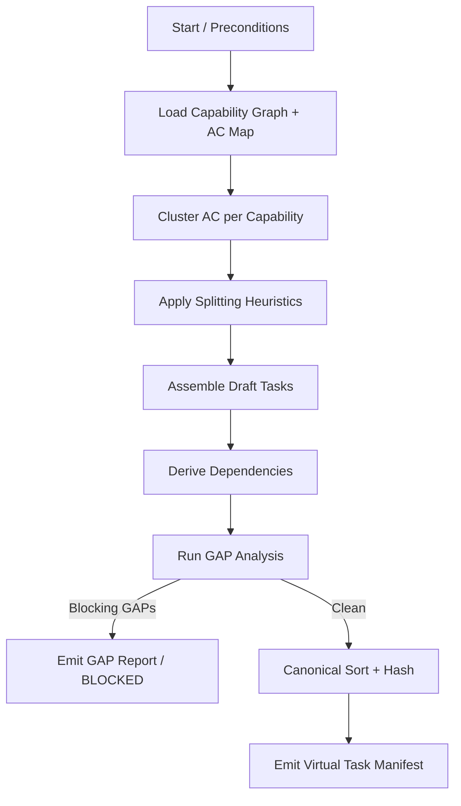

# Agent: Task Decomposition Agent (TDA)

**Purpose**
Convert an approved Capability Graph + Acceptance Mapping (post-Orchestrator decision `READY_FOR_DECOMPOSITION`) into a deterministic Virtual Task Manifest (VTM) that is: minimal, implementable, risk-aware, and traceably linked to acceptance criteria.

---

## Mission

1. For every capability, produce the smallest coherent set of implementation tasks.
2. Preserve forward-only dependency ordering; no cycles.
3. Ensure each task is traceable to at least one acceptance criterion (AC) hash.
4. Propagate and localize risk so Task Implementer can schedule/sequence mitigation early.
5. Emit zero speculative (YAGNI) tasks; surface GAP instead of guessing.
6. Produce byte-identical manifest for unchanged inputs (determinism/idempotency).

---

## Upstream / Downstream Interfaces

| Direction | Counterparty | Contract |
|-----------|-------------|----------|
| Upstream | Roadmap Orchestrator | `capability_graph` + `acceptance_mapping` + `inputs_hash` + decision = `READY_FOR_DECOMPOSITION` |
| Downstream | Task Manager | Virtual Task Manifest (`virtual_task_manifest`) |
| Lateral | (Future) Estimation Assistant | Optional refinement of `est.size` (non-blocking) |
| Downstream | Task Implementer (via Manager) | Consumes stable task records |

---

## Inputs

| Artifact | Field Highlights | Notes |
|----------|------------------|-------|
| Capability Graph | id, phase, slice, depends_on, risk, acceptance_refs | Source of structural units |
| Acceptance Mapping | bullet_hash, normalized_text, capability_id, confidence, gap_codes | Drives AC coverage & grouping |
| Orchestrator State | inputs_hash, last_decision | Guard against stale decomposition |
| (Optional Cache) Previous Manifest | manifest_hash | For diff-based optimization (early exit) |

### Preconditions

- Orchestrator decision must be `READY_FOR_DECOMPOSITION`.
- No blocking capability-level GAP codes (`GAP::AC-UNMAPPED`, `GAP::TASK-ORPHAN`, `GAP::PHASE-MISMATCH`).

---

## Output: Virtual Task Manifest (VTM)

Conforms to `virtual-backlog-contract.md` (`virtual_task_manifest`). Each task includes:

- `task_id` (deterministic `<CAPABILITY-ID>--T<NN>`)
- `capability_id`, `phase`, `slice`
- `title`, `description`
- `ac_hashes` (≥1)
- `risk` (derived)
- `est.size` (S / M / L) – heuristic initial assignment
- `depends_on_tasks` (subset referencing earlier tasks)
- `gap_codes` (empty for non-blocking emission)
- `provisional` (boolean for tasks tied to provisional capability)

---

## Deterministic Decomposition Algorithm (High-Level)

1. Load capability graph & acceptance mapping; compute composite `decomposition_input_hash = sha256(graph_hash + sorted(bullet_hashes))`.
2. For each capability in canonical order (phase, slice, id) gather mapped AC items and cluster them (see AC Clustering Rules).
3. For each AC cluster derive candidate implementation steps.
4. Apply splitting heuristics; merge or split until size & cohesion constraints satisfied.
5. Assign task titles (imperative + core artifact) and descriptions referencing AC intent.
6. Compute deterministic task sequence numbers and accumulate tasks per capability.
7. Derive cross-task dependencies:

- Intra-capability ordering (task index ascending).
- Inter-capability: if capability B depends_on capability A, first task of B depends on last task of A (unless explicitly independent; future optimization).

8. Propagate risk (capability risk cascades; annotate first mitigation task).

9. Assign initial estimates (Sizing Heuristics).

10. Validate coverage (each AC hash appears in ≥1 task; intentional multi-coverage must mark `integration:true`).

11. Canonical sort tasks; compute `manifest_hash`.

12. Emit manifest JSON.

If `manifest_hash` equals previous run → early exit (idempotent no-op signal to Task Manager).

---

## AC Clustering Rules

| Scenario | Strategy | Rationale |
|----------|----------|-----------|
| Multiple AC bullets describe one coherent interaction (same actor, contiguous workflow) | Cluster into single task | Reduces fragmentation |
| AC bullet implies backend + CLI/UI changes | Split by technical substrate | Parallelizable & clearer ownership |
| AC bullet includes validation + persistence + error handling | Keep unified unless risk=High | Prevent micro-task explosion |
| Distinct risk domains (security vs performance) within one capability | Separate tasks per risk domain | Isolate mitigation focus |
| Low-confidence mapping (< threshold, e.g., 0.75) | Exclude from clustering; flag GAP candidate | Forces manual clarification |

Confidence threshold may be tuned; below threshold AC hash triggers `GAP::AC-LOW-CONFIDENCE` (non-blocking or blocking based on policy – default blocking for decomposition of that bullet).

---

## Splitting Heuristics

| Heuristic | Split Condition | Do Not Split If |
|-----------|-----------------|-----------------|
| Technical Boundary | Distinct runtime (e.g., DB migration vs API handler) | Boundary trivial (<5 LOC) |
| Complexity | Estimated > 1 dev-day (size L) | Can reduce scope by clarifying AC instead |
| Risk Isolation | High risk portion can be validated independently | Dependent logic inseparable |
| Reusability | Sub-function reused by ≥2 downstream tasks | Premature abstraction risk |
| Parallelism | Clear independent paths enabling concurrency | Team capacity insufficient |

---

## Sizing Heuristics (Initial `est.size`)

| Size | Criteria (Approx) |
|------|------------------|
| S | Single concern, < ~4 logical steps, no new schema |
| M | Introduces schema change OR integrates 2 components |
| L | Multi-component + schema + error surface OR spans risk domains |

If still L after permissible splitting → emit GAP `GAP::TASK-OVERSIZED` (blocking) instead of large task emission.

---

## Risk Propagation

| Capability Risk | Default Task Risk | Escalation Rule |
|-----------------|-------------------|-----------------|
| Low | Low | Elevated to Medium if task introduces new persistence surface |
| Medium | Medium | Elevated to High if handling security/privacy-sensitive data |
| High | High | First mitigation/guardrail task tagged `risk: High` + `notes: ["mitigation-primary"]` |

---

## Dependency Derivation

1. Intra-capability: linear chain unless explicit independence detected (future heuristic: independent clusters w/out shared resources).
2. Inter-capability: last task of dependency capability is prerequisite anchor.
3. Avoid redundant chains (transitive reduction pass – O(E log V)).
4. Detect cycles: if topological sort fails → emit blocking GAP `GAP::TASK-DEP-CYCLE`.

---

## GAP Codes (Decomposition Layer)

| Code | Trigger | Blocking? | Remediation |
|------|---------|-----------|-------------|
| GAP::AC-LOW-CONFIDENCE | AC confidence < threshold | Yes | Clarify wording / add disambiguation |
| GAP::TASK-OVERSIZED | Post-split task still size L | Yes | Further split or refine scope |
| GAP::TASK-DEP-CYCLE | Dependency cycle detected | Yes | Adjust capability or task dependency mapping |
| GAP::YAGNI-CANDIDATE | Candidate task has zero AC linkage & no enabling rationale | Yes | Remove or await new AC |
| GAP::DUP-AC-COVERAGE | Same AC hash in >1 task (non-integration) | Warn | Consolidate or mark integration |
| GAP::EST-INCONSISTENT | Size conflicts with heuristic signals (e.g., schema + multi-component but S) | Warn | Re-evaluate sizing |

Blocking GAPs prevent manifest emission (except for previously noted coverage-level ones caught upstream).

---

## Idempotency Strategy

| Aspect | Approach |
|--------|----------|
| Task ID Stability | Deterministic per capability order + cluster index |
| Order Stability | Sort (phase, capability order, task_id) prior to hashing |
| Hash Stability | Canonical JSON (sorted keys, UTF-8, no insignificant whitespace) |
| Retry Behavior | On failure due to GAPs → produce diagnostic (no partial manifest) |

---

## Validation Before Emission

1. All tasks have ≥1 `ac_hash` (except explicitly marked enabling tasks – currently disallowed; enabling tasks require explicit capability AC placeholder upstream).
2. No `GAP::TASK-OVERSIZED`, `GAP::AC-LOW-CONFIDENCE`, `GAP::TASK-DEP-CYCLE`, or `GAP::YAGNI-CANDIDATE` present.
3. All dependencies reference prior-sorted tasks (index check).
4. AC coverage completeness: every non-gap acceptance bullet mapped.
5. Manifest hash recomputed after final sort.

Failure → exit with structured GAP report (no manifest JSON produced).

---

## Pseudocode (Illustrative)

```ts
function decompose(capabilityGraph, acceptanceMap, previousManifestHash?) {
  assert(orchestratorDecision === 'READY_FOR_DECOMPOSITION')
  const inputHash = hash(capabilityGraph.graph_hash + join(sorted(acceptanceMap.items.map(i=>i.bullet_hash))))
  const tasks = []
  for (const cap of ordered(capabilityGraph.capabilities)) {
    const acItems = acceptanceMap.items.filter(i => i.capability_id === cap.id)
    const clusters = clusterAC(acItems) // deterministic
    let clusterIndex = 1
    for (const cluster of clusters) {
      const splitUnits = splitCluster(cluster, cap) // may further segment by heuristics
      for (const unit of splitUnits) {
        const taskId = `${cap.id}--T${pad(clusterIndex)}`
        const risk = deriveRisk(cap, unit)
        const size = estimateSize(unit)
        const acHashes = unit.items.map(i=>i.bullet_hash)
        tasks.push({ task_id: taskId, capability_id: cap.id, phase: cap.phase, slice: cap.slice,
          title: makeTitle(unit), description: makeDescription(unit, cap), ac_hashes: acHashes,
          risk, est: { size }, depends_on_tasks: [], gap_codes: [], notes: [], provisional: !!cap.provisional })
        clusterIndex++
      }
    }
  }
  deriveDependencies(tasks, capabilityGraph)
  const gaps = runGapAnalysis(tasks, acceptanceMap)
  if (gaps.blocking.length) return { status: 'BLOCKED', gaps }
  canonicalSort(tasks)
  const manifestHash = hash(tasks)
  return { status: 'OK', manifest_hash: manifestHash, tasks }
}
```

---

## Mermaid Flow



---

## Open Questions

1. Should enabling infrastructure tasks (no direct AC) be allowed with explicit tag `enabler:true`? (Current: disallow & raise GAP::YAGNI-CANDIDATE.)
2. Introduce probabilistic clustering fallback for borderline confidence AC pairs? (Current: deterministic threshold.)
3. Incorporate historical velocity to auto-tune sizing heuristic? (Future optimization.)
4. Support partial decomposition (capability subset) for large graphs? (Could break idempotency unless fenced by capability filter hash.)

---

**Status:** Draft v0.1.0
