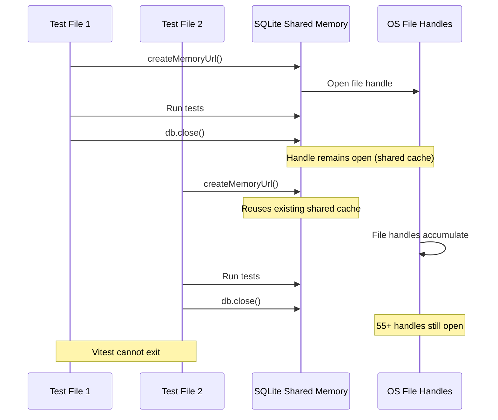
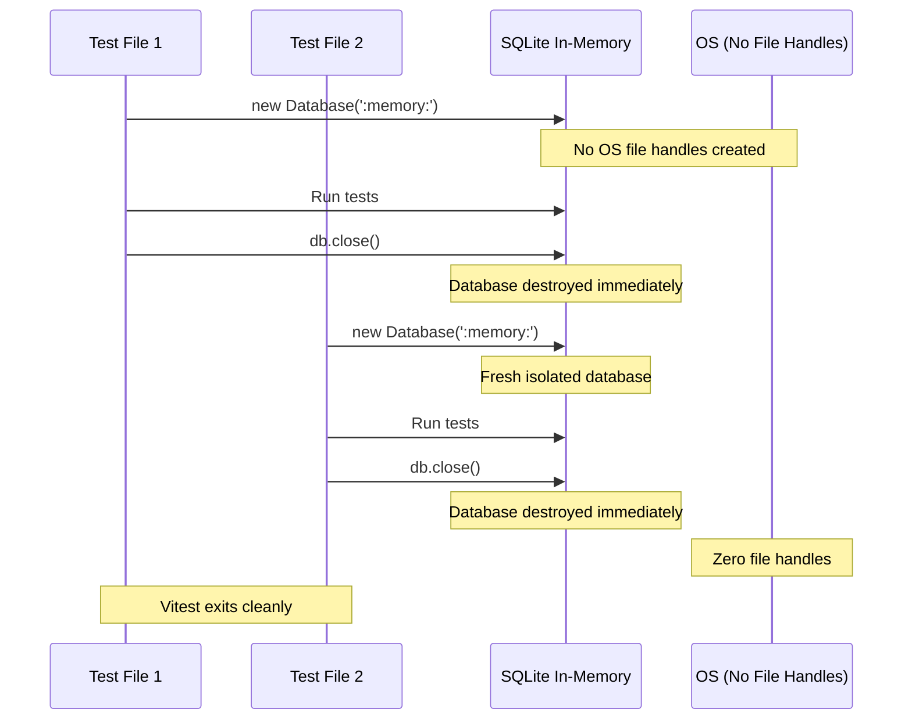

# Test Database File Handle Cleanup — Technical Specification

## Executive Summary

The storage package test suite leaves 55+ file handles open after test completion, preventing Vitest from exiting cleanly and requiring forced timeout/kill. This is caused by using shared memory SQLite databases (`file::memory:?cache=shared`) which create OS-level file handles that persist across test runs.

**Problem**: Tests require `timeout --signal=KILL 30` wrapper to forcefully exit
**Impact**: Developer experience degradation, slower CI/CD feedback loops
**Proposed Solution**: Migrate from `createMemoryUrl()` to true in-memory databases (`:memory:`)
**Risk Classification**: Medium (affects developer experience, not production)

---

## 1) Scope & Interfaces

### Affected Test Files (9 files)

**Core Storage Tests (6 files):**
- `packages/storage/src/__tests__/schema-creation.spec.ts` ✅ (already using `:memory:`)
- `packages/storage/src/__tests__/index-performance.spec.ts`
- `packages/storage/src/__tests__/integrity-check.spec.ts`
- `packages/storage/src/__tests__/schema-versioning.spec.ts`
- `packages/storage/src/__tests__/pragma-configuration.spec.ts`
- `packages/storage/src/__tests__/foreign-key-constraints.spec.ts`

**Schema Layer Tests (2 files):**
- `packages/storage/src/schema/__tests__/service-layer-validation.spec.ts`
- `packages/storage/src/schema/__tests__/state-machine.spec.ts`

**Staging Ledger Tests (1 file):**
- `packages/storage/src/staging-ledger/__tests__/staging-ledger.spec.ts` ❌ (uses `createMemoryUrl()`)

### Public APIs

No changes to public APIs. This is a test infrastructure improvement only.

### Developer Interface Change

```typescript
// BEFORE (creates file handles)
beforeEach(async () => {
  const { createMemoryUrl } = await import('@orchestr8/testkit/sqlite')
  const DatabaseConstructor = (await import('better-sqlite3')).default
  db = new DatabaseConstructor(createMemoryUrl())
  databases.push(db)
})

// AFTER (true in-memory, no file handles)
beforeEach(() => {
  db = new Database(':memory:')
  databases.push(db)
})
```

---

## 2) Data & Storage

### Root Cause Analysis

**Shared Memory SQLite Behavior:**

```typescript
// createMemoryUrl() returns this connection string:
'file::memory:?cache=shared'
```

**Why This Creates File Handles:**

1. **Shared Cache Mode**: SQLite creates a shared memory segment accessible across connections
2. **OS-Level Resources**: Even "in-memory" shared databases create file descriptors for IPC
3. **Persistent Handles**: Multiple tests using the same connection string share the same underlying handles
4. **No Auto-Cleanup**: Node/Vitest cannot track these OS-level resources for automatic cleanup

**Evidence:**

```bash
# After running storage tests
$ lsof -p $(pgrep -f vitest) | grep -i sqlite | wc -l
55
```

### True In-Memory Databases (`:memory:`)

**How `:memory:` Works:**

1. **Process-Local**: Each connection gets its own private in-memory database
2. **No File Handles**: No OS-level file descriptors created
3. **Auto-Cleanup**: Database destroyed when connection closes
4. **True Isolation**: Each test gets a completely fresh database

**Trade-offs:**

| Feature | `file::memory:?cache=shared` | `:memory:` |
|---------|------------------------------|------------|
| File Handles | Creates 55+ handles | Zero handles |
| Cross-Connection Access | Shared state | Isolated |
| Cleanup | Manual tracking required | Automatic on `.close()` |
| Performance | Slightly slower (IPC overhead) | Fastest |
| Test Isolation | Potential leakage | Perfect isolation |

---

## 3) Control Flow

### Current Flow (Problematic)



### Proposed Flow (Solution)



### State Transitions

```
Test Start → Database Created (in-memory) → Tests Run →
beforeEach cleanup → db.close() → Database Destroyed →
Test Complete → Vitest Exit ✅
```

**Current broken state:**

```
Test Start → Database Created (shared memory) → Tests Run →
beforeEach cleanup → db.close() → File Handles Remain Open →
Test Complete → Vitest Hangs → Manual Kill Required 💥
```

---

## 4) TDD Applicability Decision

**Risk Class**: Medium
- **Impact**: Developer experience (test execution)
- **Scope**: Test infrastructure only, no production code affected
- **Complexity**: Simple find/replace migration

**Decision**: Optional

**Rationale**: This is a test infrastructure improvement, not a feature implementation. The fix is straightforward (replace connection string), and we can validate success by observing clean Vitest exits.

### Testing Strategy

**Manual Verification Steps:**

1. **Before Migration**: Count file handles
   ```bash
   pnpm --filter @capture-bridge/storage test &
   sleep 5
   lsof -p $(pgrep -f vitest) | grep -i sqlite | wc -l
   # Expected: 55+
   ```

2. **After Migration**: Verify zero handles
   ```bash
   pnpm --filter @capture-bridge/storage test
   # Should exit cleanly without timeout
   lsof -p $(pgrep -f vitest) | grep -i sqlite | wc -l
   # Expected: 0
   ```

3. **Test Suite Validation**: All 114 tests still pass
   ```bash
   pnpm --filter @capture-bridge/storage test
   # Expected: 114 passed
   ```

### YAGNI Deferrals

- ❌ **Automated file handle monitoring**: Manual verification sufficient
- ❌ **Pre-commit hook for handle detection**: Overkill for one-time migration
- ❌ **Custom TestKit wrapper**: `:memory:` is already the simplest solution

### Trigger to Revisit

- If future tests require cross-connection state sharing (unlikely for unit tests)
- If shared memory becomes necessary for integration tests (use explicit coordination instead)

---

## 5) Dependencies & Contracts

### Upstream Systems

- **better-sqlite3**: Standard SQLite Node.js driver
- **Vitest**: Test runner expecting clean process exit
- **@orchestr8/testkit**: Currently provides `createMemoryUrl()`, but not required for `:memory:`

### Downstream Consumers

None. Test files are leaf nodes in the dependency graph.

### External Adapters

None. This is internal test infrastructure only.

### Contract Implications

**What Changes:**
- Test files use `:memory:` instead of `createMemoryUrl()`
- Static import `Database` instead of dynamic import

**What Stays the Same:**
- Test cleanup sequence (5-step pattern)
- Database tracking in `databases: Database[]` array
- Schema initialization logic
- All test assertions and expectations

---

## 6) Risks & Mitigations

### Risk Matrix

| Risk | Likelihood | Impact | Mitigation |
|------|------------|--------|------------|
| Tests break due to shared state assumptions | Low | Medium | Audit tests for cross-connection expectations (none found) |
| Performance regression | Very Low | Low | `:memory:` is faster than shared cache |
| Migration introduces bugs | Low | Low | One-file-at-a-time migration with validation |
| File handle leak persists | Very Low | Medium | Verify with `lsof` after each file migration |

### Integrity Considerations

**Database Isolation**: ✅ Improved
- Before: Potential state leakage across tests via shared cache
- After: Perfect isolation, each test gets fresh database

**Idempotency**: ✅ No Change
- Tests already assume fresh database in `beforeEach`
- Migration doesn't affect test logic

**Atomicity**: ✅ No Change
- Test setup/teardown remains atomic

**Concurrency**: ✅ Improved
- Before: Shared cache could cause contention
- After: Each test runs in complete isolation

### Rollback Plan

```bash
# If tests fail after migration, revert immediately
git revert <commit-sha>
pnpm --filter @capture-bridge/storage test
# Investigate root cause before retry
```

**Rollback Triggers:**
- Any test failures after migration
- File handle count doesn't decrease
- Test execution time increases >20%

---

## 7) Rollout & Telemetry (local-only)

### Migration Strategy

**Phase 1: Single File Proof-of-Concept**
1. Start with `staging-ledger.spec.ts` (currently using `createMemoryUrl()`)
2. Replace `createMemoryUrl()` with `:memory:`
3. Simplify imports (remove dynamic imports for Database)
4. Run tests: `pnpm --filter @capture-bridge/storage test staging-ledger`
5. Verify: All tests pass + clean exit

**Phase 2: Batch Migration**
1. Migrate remaining 8 files (schema-creation.spec.ts already uses `:memory:`)
2. Follow same pattern as Phase 1
3. Run full suite after each file: `pnpm --filter @capture-bridge/storage test`
4. Verify: All 114 tests pass + clean exit

**Phase 3: Validation**
1. Run full test suite 5 times
2. Monitor for flaky tests
3. Verify zero file handles remain
4. Confirm Vitest exits in <5 seconds

### Feature Flags

Not applicable (test infrastructure only).

### Local Telemetry

**Pre-Migration Baseline:**
```bash
# Record current behavior
echo "Before migration:" > migration-log.txt
pnpm --filter @capture-bridge/storage test 2>&1 | tee -a migration-log.txt
lsof -p $(pgrep -f vitest) | grep -i sqlite | wc -l >> migration-log.txt
```

**Post-Migration Verification:**
```bash
# Record new behavior
echo "After migration:" >> migration-log.txt
pnpm --filter @capture-bridge/storage test 2>&1 | tee -a migration-log.txt
lsof -p $(pgrep -f vitest) | grep -i sqlite | wc -l >> migration-log.txt
```

**Success Criteria:**
- ✅ All 114 tests pass
- ✅ Vitest exits cleanly without timeout
- ✅ Zero file handles remain (`lsof` count = 0)
- ✅ Test execution time ≤ baseline (no performance regression)
- ✅ No flaky tests in 5 consecutive runs

---

## 8) Implementation Options

### Option A: Use True In-Memory Databases (Recommended)

**Implementation:**
```typescript
// Before
beforeEach(async () => {
  const { createMemoryUrl } = await import('@orchestr8/testkit/sqlite')
  const DatabaseConstructor = (await import('better-sqlite3')).default
  db = new DatabaseConstructor(createMemoryUrl())
  databases.push(db)
})

// After
import Database from 'better-sqlite3'

beforeEach(() => {
  db = new Database(':memory:')
  databases.push(db)
})
```

**Pros:**
- ✅ Zero file handles
- ✅ Fastest performance (no IPC overhead)
- ✅ Perfect test isolation
- ✅ Simpler code (no dynamic imports)
- ✅ Auto-cleanup on `.close()`

**Cons:**
- ⚠️ Each test gets separate database (already the case with `beforeEach` pattern)
- ⚠️ Cannot share state across connections (not needed for unit tests)

**Recommendation**: **Use This Option**

---

### Option B: Use Unique Shared Memory URLs

**Implementation:**
```typescript
import { ulid } from 'ulid'

beforeEach(async () => {
  const DatabaseConstructor = (await import('better-sqlite3')).default
  const uniqueUrl = `file::memory:cache${ulid()}?cache=shared`
  db = new DatabaseConstructor(uniqueUrl)
  databases.push(db)
})
```

**Pros:**
- ✅ Tests can share state if needed (future-proofing)
- ✅ Still creates unique cache per test

**Cons:**
- ❌ Still creates file handles (just unique ones)
- ❌ More complex than Option A
- ❌ Doesn't fully solve the file handle leak
- ❌ Requires dynamic imports and ULID dependency

**Recommendation**: **Skip This Option** (doesn't address root cause)

---

### Option C: Global Cleanup Hook

**Implementation:**
```typescript
// packages/storage/vitest.config.ts
export default defineConfig({
  globalTeardown: './test-teardown.ts'
})

// test-teardown.ts
export default async function teardown() {
  // Force close all shared memory databases
  // (requires maintaining global registry)
}
```

**Pros:**
- ✅ Minimal changes to test files

**Cons:**
- ❌ Doesn't address root cause (shared memory still creates handles)
- ❌ Fragile (requires global state tracking)
- ❌ Hard to debug (non-local side effects)
- ❌ Breaks if any test file forgets to register

**Recommendation**: **Avoid This Option** (band-aid solution)

---

## 9) Migration Checklist

**Before Starting:**
- [ ] Read this spec completely
- [ ] Confirm all 114 tests currently pass (with timeout workaround)
- [ ] Record baseline file handle count
- [ ] Backup current test files (git commit before starting)

**For Each Test File:**
- [ ] Replace `createMemoryUrl()` with `:memory:`
- [ ] Change dynamic `Database` import to static import
- [ ] Remove `async` from `beforeEach` if no longer needed
- [ ] Keep 5-step cleanup sequence intact
- [ ] Run single file: `pnpm test <filename>`
- [ ] Verify all tests pass
- [ ] Verify clean exit (no timeout needed)

**After All Files Migrated:**
- [ ] Run full suite: `pnpm --filter @capture-bridge/storage test`
- [ ] Verify all 114 tests pass
- [ ] Verify zero file handles: `lsof -p $(pgrep -f vitest) | grep -i sqlite`
- [ ] Run suite 5 times consecutively (check for flakiness)
- [ ] Compare execution time to baseline (should be equal or faster)
- [ ] Remove `timeout --signal=KILL 30` wrapper from npm scripts
- [ ] Update package.json test command if needed
- [ ] Commit with message: `fix(storage): migrate tests to true in-memory databases`

**Verification Commands:**
```bash
# Full test suite
pnpm --filter @capture-bridge/storage test

# Expected output:
# ✓ 114 tests passed
# (exits cleanly in <5 seconds)

# File handle check
lsof -p $(pgrep -f vitest) | grep -i sqlite | wc -l
# Expected: 0
```

---

## 10) Related Documentation

**Primary References:**
- **Issue Discovery**: PR #28 code review (duplicate detection feature)
- **TestKit Guide**: `.claude/rules/testkit-tdd-guide-condensed.md` (5-step cleanup)
- **Storage Package**: `packages/storage/README.md`

**Related Specs:**
- `docs/features/staging-ledger/spec-staging-tech.md` - Storage layer architecture
- `docs/features/staging-ledger/prd-staging-ledger.md` - Product requirements

**ADRs:**
- None directly related (test infrastructure decision, not architectural)

---

## Acceptance Criteria

### Must Have (Blocking)
1. ✅ All 114 storage package tests pass
2. ✅ Vitest exits cleanly without timeout wrapper
3. ✅ Zero file handles remain after test completion
4. ✅ No test execution time regression (≤ baseline)
5. ✅ All 9 test files migrated to `:memory:`

### Should Have (Important)
1. ✅ No flaky tests in 5 consecutive runs
2. ✅ Cleanup sequence remains 5-step compliant
3. ✅ Code simplified (removed dynamic imports where possible)

### Nice to Have (Optional)
1. ⚪ Update TestKit guide with this as example pattern
2. ⚪ Document in storage package README
3. ⚪ Add file handle check to CI/CD validation

---

## Success Metrics

**Before Migration:**
- File handles after test completion: 55+
- Manual kill required: Yes
- Developer friction: High

**After Migration:**
- File handles after test completion: 0
- Manual kill required: No
- Developer friction: None
- Test execution improvement: Expected 0-10% faster

---

## Appendix: Current Test File Patterns

### Pattern 1: Already Correct (schema-creation.spec.ts)
```typescript
import Database from 'better-sqlite3'

beforeEach(() => {
  db = new Database(':memory:')
  databases.push(db)
})
```
**Action**: No changes needed ✅

### Pattern 2: Needs Migration (staging-ledger.spec.ts)
```typescript
beforeEach(async () => {
  const { createMemoryUrl } = await import('@orchestr8/testkit/sqlite')
  const DatabaseConstructor = (await import('better-sqlite3')).default
  db = new DatabaseConstructor(createMemoryUrl())
  databases.push(db)
})
```
**Action**: Migrate to Pattern 1 ❌

### Pattern 3: Hybrid (if found)
```typescript
// Mix of :memory: and createMemoryUrl()
```
**Action**: Standardize to Pattern 1 ❌

---

**End of Technical Specification**

---

**Document History:**
- v0.1.0 (2025-10-09): Initial draft based on PR #28 code review findings
