# ADHD Brain Documentation Index

Complete documentation tree for the ADHD Capture Bridge for Obsidian project.

## Spec Map Visualization

### Documentation Structure Overview

```mermaid
graph TD
    %% Master Level
    MasterPRD[Master PRD v2.3.0-MPPP]
    Roadmap[Roadmap v2.0.0-MPPP]

    %% Feature Level
    CapturePRD[Capture PRD]
    CLIPRD[CLI PRD]
    StagingPRD[Staging Ledger PRD]
    ObsidianPRD[Obsidian Bridge PRD]
    FoundationPRD[Foundation Monorepo PRD]

    %% Spec Chains - Capture
    CaptureARCH[spec-capture-arch.md]
    CaptureTECH[spec-capture-tech.md]
    CaptureTEST[spec-capture-test.md]

    %% Spec Chains - CLI
    CLIARCH[spec-cli-arch.md]
    CLITECH[spec-cli-tech.md]
    CLITEST[spec-cli-test.md]

    %% Spec Chains - Staging
    StagingARCH[spec-staging-arch.md]
    StagingTECH[spec-staging-tech.md]
    StagingTEST[spec-staging-test.md]

    %% Spec Chains - Obsidian
    ObsidianARCH[spec-obsidian-arch.md]
    ObsidianTECH[spec-obsidian-tech.md]
    ObsidianTEST[spec-obsidian-test.md]

    %% Cross-Cutting Specs
    FoundationTECH[spec-foundation-monorepo-tech.md]
    FoundationTEST[spec-foundation-monorepo-test.md - MISSING]
    DirectExportTECH[spec-direct-export-tech.md]
    MetricsTECH[spec-metrics-contract-tech.md]

    %% TestKit Infrastructure
    TestKitCore[TestKit Core Package]
    TestKitDomains[TestKit Domain APIs]
    TestKitFixtures[TestKit Fixtures]
    TestKitHelpers[TestKit Helpers]

    %% ADRs
    ADR0001[ADR-0001: Voice File Sovereignty]
    ADR0002[ADR-0002: Dual Hash Migration]

    %% Key Guides
    TDDGuide[guide-tdd-applicability.md]
    TestKitGuide[guide-testkit-usage.md]
    TestKitStandardization[guide-testkit-standardization.md]
    PollingGuide[guide-polling-implementation.md]
    WhisperGuide[guide-whisper-transcription.md]
    VoiceDebugGuide[guide-voice-capture-debugging.md]
    ErrorGuide[guide-error-recovery.md]
    DoctorGuide[guide-cli-doctor-implementation.md]

    %% Deferred Features
    IntelligencePRD[Intelligence PRD - DEFERRED Phase 5+]
    InboxPlaceholder[Inbox - DEFERRED Phase 5+]

    %% Master → Features
    MasterPRD --> CapturePRD
    MasterPRD --> CLIPRD
    MasterPRD --> StagingPRD
    MasterPRD --> ObsidianPRD
    MasterPRD --> FoundationPRD
    MasterPRD -.-> IntelligencePRD
    MasterPRD -.-> InboxPlaceholder

    Roadmap --> CapturePRD
    Roadmap --> CLIPRD
    Roadmap --> StagingPRD
    Roadmap --> ObsidianPRD
    Roadmap --> FoundationPRD

    %% Feature → Spec Chains (4-Document Pattern)
    CapturePRD --> CaptureARCH --> CaptureTECH --> CaptureTEST
    CLIPRD --> CLIARCH --> CLITECH --> CLITEST
    StagingPRD --> StagingARCH --> StagingTECH --> StagingTEST
    ObsidianPRD --> ObsidianARCH --> ObsidianTECH --> ObsidianTEST
    FoundationPRD --> FoundationTECH --> FoundationTEST

    %% Cross-Cutting Integration
    FoundationPRD --> DirectExportTECH
    FoundationPRD --> MetricsTECH

    %% TestKit Infrastructure Dependencies
    TestKitCore --> TestKitDomains
    TestKitDomains --> TestKitFixtures
    TestKitDomains --> TestKitHelpers

    %% Test Specs → TestKit Dependencies
    CaptureTEST -.-> TestKitCore
    CaptureTEST -.-> TestKitDomains
    CaptureTEST -.-> TestKitFixtures
    CLITEST -.-> TestKitCore
    CLITEST -.-> TestKitDomains
    StagingTEST -.-> TestKitCore
    StagingTEST -.-> TestKitDomains
    StagingTEST -.-> TestKitHelpers
    ObsidianTEST -.-> TestKitCore
    ObsidianTEST -.-> TestKitDomains
    ObsidianTEST -.-> TestKitHelpers
    FoundationTEST -.-> TestKitCore

    %% ADR Impacts
    ADR0001 -.->|Affects| CapturePRD
    ADR0001 -.->|Affects| StagingPRD
    ADR0002 -.->|Deferred Impact| StagingPRD

    %% Guide Support
    TDDGuide -.->|Supports| CaptureTECH
    TDDGuide -.->|Supports| CLITECH
    TDDGuide -.->|Supports| StagingTECH
    TDDGuide -.->|Supports| ObsidianTECH
    TDDGuide -.->|Supports| FoundationTECH

    TestKitGuide -.->|Supports| CaptureTEST
    TestKitGuide -.->|Supports| CLITEST
    TestKitGuide -.->|Supports| StagingTEST
    TestKitGuide -.->|Supports| ObsidianTEST
    TestKitGuide -.->|Supports| FoundationTEST

    TestKitStandardization -.->|Anti-Pattern Guide| CaptureTEST
    TestKitStandardization -.->|Anti-Pattern Guide| ObsidianTEST

    PollingGuide -.->|Supports| CaptureTECH
    WhisperGuide -.->|Supports| CaptureTECH
    VoiceDebugGuide -.->|Supports| CaptureTECH
    VoiceDebugGuide -.->|Supports| CaptureTEST
    ErrorGuide -.->|Supports| CaptureTECH
    ErrorGuide -.->|Supports| StagingTECH
    DoctorGuide -.->|Supports| CLITECH

    %% Styling
    classDef masterDocs fill:#4A90E2,stroke:#2E5C8A,stroke-width:3px,color:#fff
    classDef activePRD fill:#7ED321,stroke:#5FA319,stroke-width:2px,color:#000
    classDef archSpec fill:#F5A623,stroke:#C78519,stroke-width:2px,color:#000
    classDef techSpec fill:#BD10E0,stroke:#8B0AA8,stroke-width:2px,color:#fff
    classDef testSpec fill:#50E3C2,stroke:#3AB09E,stroke-width:2px,color:#000
    classDef testkitInfra fill:#00D4AA,stroke:#00A08A,stroke-width:2px,color:#fff
    classDef adrDocs fill:#D0021B,stroke:#9A0114,stroke-width:2px,color:#fff
    classDef guideDocs fill:#F8E71C,stroke:#BAAD15,stroke-width:2px,color:#000
    classDef deferredDocs fill:#9B9B9B,stroke:#6D6D6D,stroke-width:2px,color:#fff,stroke-dasharray: 5 5
    classDef crossCutting fill:#B8E986,stroke:#8FB866,stroke-width:2px,color:#000
    classDef missingDocs fill:#FF6B6B,stroke:#FF4757,stroke-width:2px,color:#fff,stroke-dasharray: 3 3

    class MasterPRD,Roadmap masterDocs
    class CapturePRD,CLIPRD,StagingPRD,ObsidianPRD,FoundationPRD activePRD
    class CaptureARCH,CLIARCH,StagingARCH,ObsidianARCH archSpec
    class CaptureTECH,CLITECH,StagingTECH,ObsidianTECH,FoundationTECH,DirectExportTECH,MetricsTECH techSpec
    class CaptureTEST,CLITEST,StagingTEST,ObsidianTEST testSpec
    class FoundationTEST missingDocs
    class TestKitCore,TestKitDomains,TestKitFixtures,TestKitHelpers testkitInfra
    class ADR0001,ADR0002 adrDocs
    class TDDGuide,TestKitGuide,TestKitStandardization,PollingGuide,WhisperGuide,VoiceDebugGuide,ErrorGuide,DoctorGuide guideDocs
    class IntelligencePRD,InboxPlaceholder deferredDocs
```



### Legend

**Document Types:**

- 🔵 **Master Documents** (Blue) - Master PRD & Roadmap (source of truth)
- 🟢 **Feature PRDs** (Green) - Feature requirements and scope
- 🟠 **ARCH Specs** (Orange) - Architecture and component design
- 🟣 **TECH Specs** (Purple) - Technical implementation details
- 🔷 **TEST Specs** (Cyan) - Test strategies and contracts
- 🟦 **TestKit Infrastructure** (Teal) - Testing foundation and utilities
- 🔴 **ADRs** (Red) - Architecture decision records
- 🟡 **Guides** (Yellow) - Cross-cutting how-to documentation
- 🔴 **Missing Documents** (Red, Dashed) - Required but not yet created
- ⚫ **Deferred** (Gray, Dashed) - Phase 3+ or Phase 5+ features

**Relationship Types:**

- **Solid Lines** (→) - Direct dependency/derivation
- **Dotted Lines** (-.→) - Support/influence relationship

**Phase Assignments:**

- **Phase 1-2 (MPPP):** Capture, CLI, Staging Ledger, Obsidian Bridge, Foundation Monorepo
- **Phase 3+ (Deferred):** PARA classification, daily note linking
- **Phase 5+ (Deferred):** Intelligence (AI/ML), Inbox UI

---

## Feature Document Chains (4-Document Rule)

### Phase 1-2 Active Features

#### Capture Feature (100% Complete)

```
prd-capture.md (v3.1.0) ✅ Living
  └─ spec-capture-arch.md (v0.1.0) ✅ Living
      └─ spec-capture-tech.md (v0.1.0) ✅ Living
          └─ spec-capture-test.md (v0.1.0) ✅ Living
```

**ADR Links:** ADR-0001 (Voice File Sovereignty)
**Guide Links:** guide-polling-implementation.md, guide-whisper-transcription.md, guide-gmail-oauth2-setup.md, guide-capture-debugging.md, guide-voice-capture-debugging.md, guide-tdd-applicability.md, guide-testkit-usage.md, guide-error-recovery.md

---

#### CLI Feature (100% Complete)

```
prd-cli.md (v1.0.0) ✅ Draft
  └─ spec-cli-arch.md (v1.0.0) ✅ Draft
      └─ spec-cli-tech.md (v1.0.0) ✅ Draft
          └─ spec-cli-test.md (v1.0.0) ✅ Draft
```

**ADR Links:** None
**Guide Links:** guide-cli-doctor-implementation.md, guide-health-command.md, guide-cli-extensibility-deferred.md, guide-tdd-applicability.md, guide-testkit-usage.md

---

#### Staging Ledger Feature (100% Complete)

```
prd-staging.md (v1.0.0-MPPP) ✅ Final
  └─ spec-staging-arch.md (v0.1.0) ✅ Final
      └─ spec-staging-tech.md (v0.1.0) ✅ Final
          └─ spec-staging-test.md (v0.1.0) ✅ Final
```

**ADR Links:** ADR-0001 (Voice File Sovereignty), ADR-0002 (Dual Hash Migration - Deferred)
**Guide Links:** guide-error-recovery.md, guide-crash-matrix-test-plan.md, guide-tdd-applicability.md, guide-testkit-usage.md
**Additional Docs:** schema-indexes.md (database schema reference)

---

#### Obsidian Bridge Feature (100% Complete)

```
prd-obsidian.md (v1.0.0-MPPP) ✅ Draft
  └─ spec-obsidian-arch.md (v1.0.0) ✅ Draft
      └─ spec-obsidian-tech.md (v1.0.0) ✅ Draft
          └─ spec-obsidian-test.md (v1.0.0) ✅ Draft
```

**ADR Links:** None
**Guide Links:** guide-tdd-applicability.md, guide-testkit-usage.md

---

#### Foundation Monorepo (50% Complete) ⚠️

```
prd-foundation-monorepo.md (v1.0.0-MPPP) ✅ Draft
  └─ spec-foundation-monorepo-arch.md ❌ MISSING
      └─ spec-foundation-monorepo-tech.md (v1.0.0) ✅ Draft
          └─ spec-foundation-monorepo-test.md ❌ MISSING
```

**ADR Links:** None
**Guide Links:** guide-monorepo-mppp.md, guide-tdd-applicability.md
**Status:** ARCH and TEST specs recommended before Phase 1 implementation

---

### Cross-Cutting Infrastructure

#### Direct Export (TECH-Only Pattern)

```
spec-direct-export-tech.md (v1.0.0) ✅ Review
```

**Purpose:** Direct synchronous export patterns (no outbox queue)
**Status:** Complete (cross-cutting infrastructure, no PRD/ARCH/TEST required)

---

#### Metrics Contract (TECH-Only Pattern)

```
spec-metrics-contract-tech.md (v1.0.0) ✅ Draft
```

**Purpose:** Local NDJSON metrics collection contracts
**Status:** Complete (cross-cutting infrastructure, no PRD/ARCH/TEST required)

---

### Deferred Features (Phase 3+ / Phase 5+)

#### Intelligence Feature (DEFERRED Phase 5+)

```
prd-intelligence.md (skeletal) ⚫ Deferred
  └─ spec-intelligence-arch.md (skeletal) ⚫ Deferred
      └─ spec-intelligence-tech.md (skeletal) ⚫ Deferred
          └─ spec-intelligence-test.md (skeletal) ⚫ Deferred
```

**Trigger:** Semantic search usage > 10 queries/day for 7 consecutive days OR keyword search fail rate > 20% week-over-week

---

#### Inbox Feature (DEFERRED Phase 5+)

```
inbox/ (.gitkeep only) ⚫ Deferred
```

**Trigger:** > 1000 captures AND batch triage friction reported

---

## ADR Impact Map

### ADR-0001: Voice File Sovereignty (Accepted)

**Decision:** Never move, copy, or rename Apple Voice Memo files. Reference in-place only.

**Affects:**

- ✅ Capture PRD (Section 5.1: Voice Capture)
- ✅ Capture ARCH (Voice memo referencing)
- ✅ Capture TECH (Section 7: Voice Memo Referencing)
- ✅ Staging Ledger PRD (meta_json.file_path storage)
- ✅ Staging Ledger ARCH (captures table design)
- ✅ Staging Ledger TECH (file_path + audio_fp pattern)

**Implementation Impact:** High - Core architectural constraint enforced across all voice capture paths

---

### ADR-0002: Dual Hash Migration (Proposed - Deferred Phase 2+)

**Decision:** Phased migration from SHA-256 to BLAKE3 for content hashing.

**Affects:**

- ⚫ Staging Ledger (future migration strategy)
- ⚫ Capture (hash computation)

**Implementation Impact:** Low (MPPP uses SHA-256 only) - Deferred until > 200 daily captures OR credible false-duplicate incident

---

## Guide → Feature Mapping

### Cross-Feature Guides (Support Multiple Features)

**guide-tdd-applicability.md**

- Supports: All TECH specs (Capture, CLI, Staging, Obsidian, Foundation)
- Purpose: TDD decision framework and risk classification

**guide-testkit-usage.md**

- Supports: All TEST specs (Capture, CLI, Staging, Obsidian)
- Purpose: Test isolation patterns and TestKit API usage

**guide-error-recovery.md**

- Supports: Capture TECH, Staging Ledger TECH
- Purpose: Error handling patterns and retry policies

**guide-phase1-testing-patterns.md**

- Supports: All TEST specs
- Purpose: Phase 1-specific testing patterns (sequential processing, no concurrency)

---

### Feature-Specific Guides

**Capture Feature Guides:**

- guide-polling-implementation.md (voice + email polling workers)
- guide-whisper-transcription.md (local Whisper medium model integration)
- guide-gmail-oauth2-setup.md (Gmail API authentication)
- guide-capture-debugging.md (debugging capture workflows)

**CLI Feature Guides:**

- guide-cli-doctor-implementation.md (health check implementation)
- guide-health-command.md (health check patterns)
- guide-cli-extensibility-deferred.md (CLI plugin deferral catalog)

**Foundation Guides:**

- guide-monorepo-mppp.md (monorepo structure and patterns)

**Testing Guides:**

- guide-crash-matrix-test-plan.md (fault injection testing)

---

## Quick Navigation by Phase

### Phase 1: Core Ingestion (Weeks 1-4)

**Priority:** P0 - Critical Path

**Foundation (Week 1-2):**

1. Foundation Monorepo PRD → TECH
2. Direct Export TECH
3. Metrics Contract TECH

**Capture Paths (Week 2-3):**

1. Capture PRD → ARCH → TECH → TEST
2. Staging Ledger PRD → ARCH → TECH → TEST

**Integration (Week 3-4):**

1. Obsidian Bridge PRD → ARCH → TECH → TEST
2. CLI PRD → ARCH → TECH → TEST

---

### Phase 2: Hardening (Weeks 5-6)

**Priority:** P1 - Production Readiness

**Error Handling:**

- Capture error recovery (guide-error-recovery.md)
- Staging Ledger backup verification
- Crash matrix testing (guide-crash-matrix-test-plan.md)

**Operations:**

- CLI health command (guide-cli-doctor-implementation.md)
- Metrics collection validation
- Storage cleanup policies

---

### Phase 3+ / Phase 5+: Deferred Features

**Status:** Not in MPPP Scope

- PARA classification (trigger: manual organization > 10 min/day for 2 weeks)
- Inbox UI (trigger: > 1000 captures + batch friction)
- AI/ML features (trigger: semantic search demand or keyword search failure rate)

---

## Master Documentation

**[prd-master.md](./prd-master.md)**
**Purpose:** Complete system requirements, architecture, and implementation roadmap
**Key Topics:** SQLite staging ledger, capture channels, deduplication, PARA integration

**[roadmap.md](./roadmap.md)**
**Purpose:** High-level implementation phases and milestones
**Key Topics:** Phase 1-4 timeline, feature prioritization

---

## Features

### Active Development (Phase 1-4)

#### Capture (Phase 1-3)

- **[prd-capture.md](../features/capture/prd-capture.md)** - Voice/text/email capture requirements
- **[spec-capture-arch.md](../features/capture/spec-capture-arch.md)** - Architecture and data flow
- **[spec-capture-tech.md](../features/capture/spec-capture-tech.md)** - Technical implementation
- **[spec-capture-test.md](../features/capture/spec-capture-test.md)** - Test specification

#### CLI (Phase 1-4)

- **[prd-cli.md](../features/cli/prd-cli.md)** - CLI feature requirements
- **[spec-cli-arch.md](../features/cli/spec-cli-arch.md)** - CLI architecture and component design
- **[spec-cli-tech.md](../features/cli/spec-cli-tech.md)** - Command specifications and implementation
- **[spec-cli-test.md](../features/cli/spec-cli-test.md)** - CLI testing contracts

#### Staging Ledger (Phase 1-2)

- **[prd-staging.md](../features/staging-ledger/prd-staging.md)** - SQLite staging requirements
- **[spec-staging-arch.md](../features/staging-ledger/spec-staging-arch.md)** - Ledger architecture
- **[spec-staging-tech.md](../features/staging-ledger/spec-staging-tech.md)** - Database schema and operations
- **[spec-staging-test.md](../features/staging-ledger/spec-staging-test.md)** - Data integrity testing
- **[schema-indexes.md](../features/staging-ledger/schema-indexes.md)** - Database schema and index definitions

#### Obsidian Bridge (Phase 4)

- **[prd-obsidian.md](../features/obsidian-bridge/prd-obsidian.md)** - Vault integration requirements
- **[spec-obsidian-arch.md](../features/obsidian-bridge/spec-obsidian-arch.md)** - Bridge architecture
- **[spec-obsidian-tech.md](../features/obsidian-bridge/spec-obsidian-tech.md)** - Atomic write implementation
- **[spec-obsidian-test.md](../features/obsidian-bridge/spec-obsidian-test.md)** - Vault write testing
- **[guide-obsidian-bridge-usage.md](../guides/guide-obsidian-bridge-usage.md)** - Quick-start usage guide for atomic writer

### Deferred Features (Phase 5+)

#### Intelligence (AI/ML)

**Status:** DEFERRED Phase 5+ - Not needed for MVP (placeholder in `/docs/features/intelligence/.gitkeep`)

#### Inbox

**Status:** DEFERRED Phase 5+ - Manual triage not needed for MVP (placeholder in `/docs/features/inbox/.gitkeep`)

---

## Cross-Cutting Infrastructure

Infrastructure components and shared technical specifications.

### Monorepo & Build System

- **[prd-foundation-monorepo.md](../cross-cutting/prd-foundation-monorepo.md)** - Monorepo MVP strategy and requirements
- **[spec-foundation-monorepo-tech.md](../cross-cutting/spec-foundation-monorepo-tech.md)** - Turborepo + pnpm workspaces implementation

### Shared Technical Contracts

- **[spec-direct-export-tech.md](../cross-cutting/spec-direct-export-tech.md)** - Direct export patterns for package APIs
- **[spec-metrics-contract-tech.md](../cross-cutting/spec-metrics-contract-tech.md)** - Metrics collection and reporting contracts

---

## Architecture Decision Records (ADRs)

See [ADR Index](../adr/_index.md)

**Strategic Decisions (Master Planning)**:

- **[ADR-0003: Four-Table Hard Cap](../adr/0003-four-table-hard-cap.md)** - Core durability architecture
- **[ADR-0008: Sequential Processing MPPP](../adr/0008-sequential-processing-mppp.md)** - No concurrency in MPPP
- **[ADR-0011: Inbox-Only Export Pattern](../adr/0011-inbox-only-export-pattern.md)** - No classification in MPPP

**Foundation Decisions**:

- **[ADR-0001: Voice File Sovereignty](../adr/0001-voice-file-sovereignty.md)** - Never move/copy Apple Voice Memos
- **[ADR-0002: Dual Hash Migration](../adr/0002-dual-hash-migration.md)** - SHA-256 → BLAKE3 phased migration (deferred)

---

## Guides

Practical how-to documentation and best practices.

### Testing & Quality

- **[guide-tdd-applicability.md](../guides/guide-tdd-applicability.md)** - When and how to apply TDD
- **[guide-test-strategy.md](../guides/guide-test-strategy.md)** - Test strategy and patterns
- **[guide-testkit-usage.md](../guides/guide-testkit-usage.md)** - TestKit patterns and examples
- **[guide-phase1-testing-patterns.md](../guides/guide-phase1-testing-patterns.md)** - Phase 1 testing patterns and approaches
- **[guide-crash-matrix-test-plan.md](../guides/guide-crash-matrix-test-plan.md)** - Crash scenario test planning
- **[guide-fault-injection-registry.md](../guides/guide-fault-injection-registry.md)** - Authoritative fault injection hook catalog

### Capture Implementation

- **[guide-polling-implementation.md](../guides/guide-polling-implementation.md)** - Voice memo and email polling workers
- **[guide-gmail-oauth2-setup.md](../guides/guide-gmail-oauth2-setup.md)** - Gmail authentication and polling cursor
- **[guide-whisper-transcription.md](../guides/guide-whisper-transcription.md)** - Local audio transcription implementation
- **[guide-capture-debugging.md](../guides/guide-capture-debugging.md)** - General capture debugging techniques
- **[guide-voice-capture-debugging.md](../guides/guide-voice-capture-debugging.md)** - Voice memo specific troubleshooting (APFS dataless files, iCloud sync, voice memo metadata, iOS sync detection)

### CLI Implementation

- **[guide-cli-doctor-implementation.md](../guides/guide-cli-doctor-implementation.md)** - Doctor command implementation guide
- **[guide-cli-extensibility-deferred.md](../guides/guide-cli-extensibility-deferred.md)** - Deferred CLI features catalog
- **[guide-health-command.md](../guides/guide-health-command.md)** - Health check command usage

### Monorepo & Architecture

- **[guide-monorepo-mppp.md](../guides/guide-monorepo-mppp.md)** - Monorepo Package Publishing Protocol
- **[guide-error-recovery.md](../guides/guide-error-recovery.md)** - Error recovery patterns
- **[guide-resilience-patterns.md](../guides/guide-resilience-patterns.md)** - Resilience patterns and strategies for external services

### Obsidian Bridge Implementation

- **[guide-obsidian-bridge-usage.md](../guides/guide-obsidian-bridge-usage.md)** - Atomic writer quick-start and integration guide

### Operations & Reliability

- **[guide-backup-verification.md](../guides/guide-backup-verification.md)** - Automated backup verification and escalation
- **[guide-backup-restore-drill.md](../guides/guide-backup-restore-drill.md)** - Backup restore procedures and runbook

### Process & Workflow

- **[guide-agent-usage.md](../guides/guide-agent-usage.md)** - Using AI agents for documentation tasks
- **[guide-acceptance-criteria-task-extraction.md](../guides/guide-acceptance-criteria-task-extraction.md)** - Extracting tasks from acceptance criteria

---

## Templates

Document templates for consistent documentation structure.

- **[prd-template.md](../templates/prd-template.md)** - Product Requirements Document template
- **[arch-spec-template.md](../templates/arch-spec-template.md)** - Architecture specification template
- **[tech-spec-template.md](../templates/tech-spec-template.md)** - Technical specification template
- **[test-spec-template.md](../templates/test-spec-template.md)** - Test specification template
- **[guide-template.md](../templates/guide-template.md)** - Guide document template
- **[audit-checklist.md](../templates/audit-checklist.md)** - Documentation audit checklist

---

## Agents

AI agent specifications for documentation maintenance. See [README-agents-usage.md](../agents/README-agents-usage.md) for usage guide.

- **[README-agents-usage.md](../agents/README-agents-usage.md)** - Agent usage and best practices guide
- **[adr-curator.md](../agents/adr-curator.md)** - ADR creation and maintenance
- **[documentation-steward.md](../agents/documentation-steward.md)** - General doc maintenance
- **[roadmap-orchestrator.md](../agents/roadmap-orchestrator.md)** - Roadmap management and coordination
- **[spec-architect.md](../agents/spec-architect.md)** - Specification creation
- **[spec-librarian.md](../agents/spec-librarian.md)** - Documentation organization
- **[spec-orchrestrator.md](../agents/spec-orchrestrator.md)** - Spec coordination
- **[task-decomposition-agent.md](../agents/task-decomposition-agent.md)** - Breaking down tasks
- **[task-implementer.md](../agents/task-implementer.md)** - Task implementation execution
- **[task-manager.md](../agents/task-manager.md)** - Task tracking and management
- **[test-strategist.md](../agents/test-strategist.md)** - Testing strategy
- **[virtual-backlog-contract.md](../agents/virtual-backlog-contract.md)** - Virtual backlog contract specification
- **[yagni-enforcer.md](../agents/yagni-enforcer.md)** - YAGNI boundary enforcement

---

## Audits

Documentation audit reports and quality assessments.

- **[comprehensive-spec-librarian-audit-2025-09-28.md](../audits/comprehensive-spec-librarian-audit-2025-09-28.md)** - Complete documentation tree audit

---

## Backlog

Task tracking and capability graphs for implementation planning.

- **[capability-graph.json](../backlog/capability-graph.json)** - JSON representation of capability dependencies
- **[documentation-remediation-tasks.md](../backlog/documentation-remediation-tasks.md)** - Documentation remediation tasks
- **[orchestrator-report.md](../backlog/orchestrator-report.md)** - Orchestrator planning report
- **[prd-remediation-tasks.md](../backlog/prd-remediation-tasks.md)** - PRD remediation tasks

---

## Deferred Features

Features explicitly deferred to Phase 3+ or Phase 5+ with trigger conditions documented in Master PRD and Roadmap.

- Intelligence (AI/ML) - Phase 5+ - See `/docs/features/intelligence/.gitkeep`
- Inbox UI - Phase 5+ - See `/docs/features/inbox/.gitkeep`

---

## Navigation Tips

### By Phase

**Phase 1 (Weeks 1-2): Foundation + Voice Capture**

- Monorepo specs (cross-cutting)
- Staging ledger specs (features/staging-ledger)
- Capture specs (features/capture)
- CLI basics (features/cli)

**Phase 2 (Weeks 3-4): Voice Memos Integration**

- Capture polling workers (features/capture)
- Voice memo processing
- Test infrastructure (cross-cutting)

**Phase 3 (Weeks 5-6): Email Capture**

- Email capture (features/capture)
- Email parsing
- Batch operations (CLI)

**Phase 4 (Weeks 7-8): Obsidian Integration**

- Obsidian bridge (features/obsidian-bridge)
- Vault connector
- Conflict resolution

**Phase 5+ (Future): Deferred Features**

- Intelligence/AI (features/intelligence) - Deferred
- Inbox UI (features/inbox) - Deferred
- Web clipper - Not started
- Quick text - Not started

### By Role

**Product Owner:**

- Start with Master PRD
- Review feature PRDs for scope
- Check roadmap for timeline

**Architect:**

- Review cross-cutting specs
- Check ADRs for decisions
- Review feature architecture specs

**Developer:**

- Review technical specs for implementation
- Check test specs for TDD requirements
- Use guides for best practices

**QA/Tester:**

- Review test specifications
- Check TDD applicability guide
- Review test coordinator spec

---

## Document Status Legend

- **draft** - Work in progress, not ready for implementation
- **review** - Ready for review, awaiting approval
- **approved** - Approved for implementation
- **living** - Active document, evolves with implementation
- **deferred-phase-5** - Explicitly deferred to future phases
- **deprecated** - No longer current, replaced by newer spec

---

## Contributing

**Before Creating New Documentation:**

1. Check if topic fits existing spec (prefer editing over creating)
2. Use appropriate template from `/docs/templates/`
3. Follow naming conventions:
   - PRDs: `prd-<feature>.md`
   - Arch specs: `spec-<feature>-arch.md`
   - Tech specs: `spec-<feature>-tech.md`
   - Test specs: `spec-<feature>-test.md`
4. Add proper YAML front matter
5. Update this index

**Documentation Review Process:**

- Cross-cutting changes: Requires all feature owners' review
- Feature-specific changes: Requires architect review
- ADRs: Requires team consensus

---

## Documentation Statistics

**Last Updated:** 2025-09-28
**Total Documentation Files:** 95 markdown files

**Phase 1-2 Coverage:**

- **Active Features:** 5 (Capture, CLI, Staging Ledger, Obsidian Bridge, Foundation Monorepo)
- **4-Document Chain Compliance:** 90% (4 of 5 complete)
- **Cross-Cutting Specs:** 3 (Foundation, Direct Export, Metrics)

**Deferred Features:** 2 (Intelligence Phase 5+, Inbox Phase 5+)

**Supporting Documentation:**

- **Guides:** 17 cross-cutting guides
- **ADRs:** 2 architecture decisions (1 accepted, 1 proposed)
- **Templates:** 6 document templates
- **Agents:** 13 AI agent specifications

**Audit Trail:**

- **Active Audits:** 8 current audit reports
- **Archived Audits:** 11 historical reports

**Quality Metrics:**

- **Version Alignment:** 100% (all PRDs reference Master PRD v2.3.0-MPPP)
- **Front Matter Compliance:** 100%
- **TDD Applicability Sections:** 100% of TECH specs
- **ADR Linkage:** 100% (all accepted ADRs referenced)
- **MPPP Scope Compliance:** 100% (zero scope creep detected)

**Overall Documentation Health Score:** 96/100 (Excellent)
